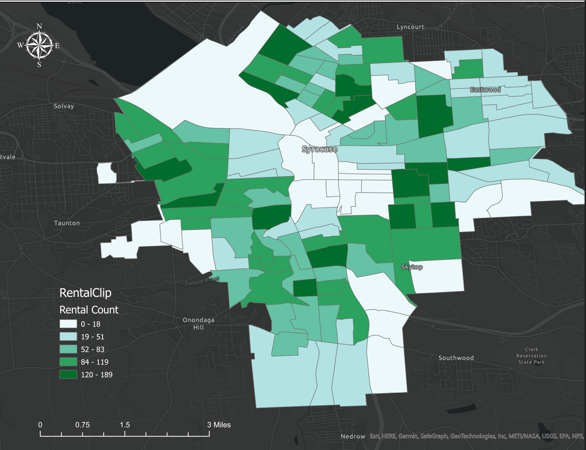

## Portfolio and Professional Background

---
# Kristine Kahler 
## GeoSpatial Technology 
218-839-1327 / kkahler190@gmail.com

# Background and Experience
## OBJECTIVE: 
GIS and Planning professional with 8 years experience in volunteer and professional roles, combined with extensive ESRI and ArcGIS, QGIS product knowledge and use. Excels in organizing complex datasets into maps for accessibility and communication. Excellent in solo, team, and leadership roles. 
### TECHNICAL EXPERIENCE

ArcGIS 10.x, ArcGIS Pro • ArcGIS Online • SDE/Spatial Databases • Data Analysis •SDSFIE • Database • Python/Modelbuilder • Editing/Analysis • Georeferencing • Geoprocessing • Rstudio • PostGIS/SQL • QGIS
### EDUCATION 
University of Oklahoma, Norman, OK 
- May 2024, M.S. Geospatial Technology
  

St. Cloud State University, St. Cloud, MN
- May 2015 BA Planning and Community Development
- Environmental Planning
- GIS in Planning
- GIS minor
  
# PROFESSIONAL EXPERIENCE
###  Insight Global/HDR Inc 2023- Current 
GIS Analyst. Data Enhancement. Update USAFA Infrastructure GIS/Geodatabase working with As-Built Documents. 
###  Experis/National Grid 2022-2023
GIS Technician/Electric Data Analyst. Data Enhancement.  Update Electric database, verify objects, modify maps related to electric feeders. 
###  Freelance GIS Specialist (self-employed, ongoing), 2011 – Current 
Working with local agencies, and nonprofits as analyst, technician. QGIS, ArcPro, ArcMap 10.x
###  ESG Consulting, Inc (GDOT) MGRC, Macon GA 2021 – 2022
 GIS Technician • Update GDOT GIS database, digitizing local roadway features. • MAP-21 Federal Project (REVAMP) • ArcPro 2.9 
###  Aerotek (Ramtech) Stillwater, MN, 2021 
GIS Technician II • Maintain, and update the SDE database, digitizing service lines, and related features based on legacy work orders. 
Assist GIS Tech I coworkers with GIS, gas service projects. 
###  Mindlance (Xcel Energy) Minneapolis, MN, 2020 – 2021 
GIS Technician III (contract) • Created energy-related cases for new and existing services. Query client DB and GIS, related to Tax jurisdiction, existing service and new joint trench (plats) projects. 
###  Business Technical Services, Dayton, OH, 2020 
Meter Survey Technician (contract) • Data collection and meter survey project using ArcGIS Collector/Survey, QA/QC field work in client’s ArcGIS, ArcGIS Online 10x 
### Aitkin County, Aitkin, MN, 2016 Environmental Services- Intern 
 Updated County GIS Data using ArcGIS Online, ArcMap 10.x Collector apps. • Located and digitized/GPS wells based on MN Dept. of Health and County historical records. Converted tabular data to spatial data. 
### City of Baxter, Baxter, MN, 2014, Intern 
Query SQL DB for data relating to land use cases. Updated, digitized, and maintained city/county GIS land use cases, public works road and utility features with ArcMap 10.6.
### Category Name 1 

---

---

---

---
### Category Name 2

- [Saudi Digital Image Processing Classification](https://github.com/KristineMK72/Kristine-Kahler/files/14337745/SaudiLab.pdf)

- [Brainerd](https://github.com/KristineMK72/Kristine-Kahler/issues/1)
- [Project 3 Title](http://example.com/)
- [Project 4 Title](http://example.com/)
- [Project 5 Title](http://example.com/)

---

---

Page template forked from <a href="https://github.com/evanca/quick-portfolio">evanca</a>

<!-- Remove above link if you don't want to attibute -->
